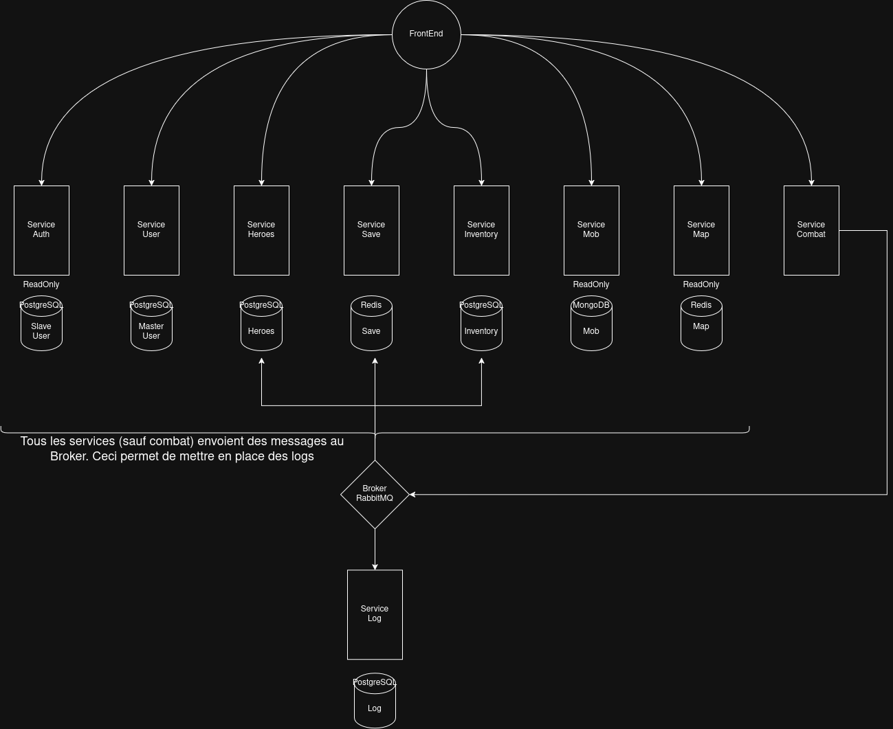
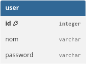
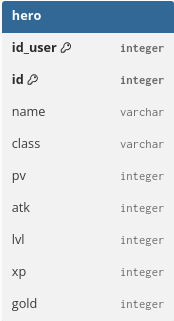
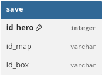
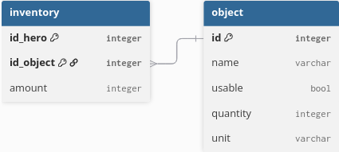
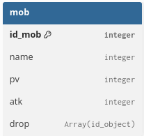
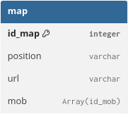
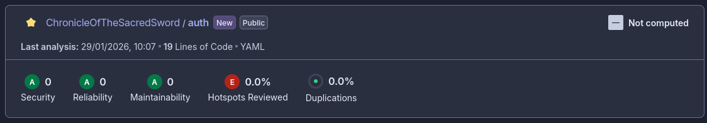

# Documentation Chronicle Of The Sacred Sword

## Répartition des tâches

- Thomas : `Authentification` et `User`

- Valentine : `Inventaire`, `Mob` et `Map`

- Louis : `Héros` et `Sauvegarde`

--- 

## Cas d'utilisation de l'application

Pour définir l'architecture de notre application, nous avons tout d'abord défini un cas d'utilisation typique utilisant toutes les fonctionnalités de l'application.
Il s'agit de l'utilisation du jeux, de la création du compte, jusqu'à la sauvegarde et la fermeture du jeu :

### Utilisation typique 

Un utilisateur arrive sur le site, il se créer un compte.

- `POST /user` (identifiant, mot de passe) dans un service `User`.

Il se connecte.

- `POST /auth` (identifiant, mot de passe) dans un service `Authentification`

Il créer un héros.

- `POST /hero` (idUser, nom héros, type héros) dans un service `Heros`
- `POST /save` (idhero, idEcran, idCase) dans un service `Sauvegarde`

Il récupère sa liste de héros.

- `GET /hero/:idUser` dans le service `Heros`

Il choisit son héros (sauvegarde).

- `GET /save/:idhero` dans le service `Sauvegarde`

Il arrive sur la carte.

- `GET /inventory/hero/:idhero` pour récupérer l'inventaire du héros depuis un service `Inventaire`
- `GET /map/:idEcran` afin de charger la carte depuis un service `Map`
- `GET /map/mob` retourne les mobs pouvant apparaître sur cette écran.

Il se déplace.

- Que du front

Un monstre apparaît.

- `GET /mob/:idMob` récupère un ennemi depuis le service `Mob`

Un combat se lance.

- que du front

Il gagne le combat.

- front

Il gagne de l'expérience, de l'or et une potion.

On envoi à un Broker les actions à réaliser dans une Queue :

- `POST /inventaire` (id objet, id hero, amount) ajoute un objet à l'inventaire du héro dans le service `Inventaire`.
- `PUT /hero` pour mettre à jour les informations du héros
- `PUT /save` pour mettre à jour la position du hero dans la sauvegarde.

Ajout d'un service `Combat` qui enverra des messages au broker.

Il utilise la potion.

- `DELETE /inventaire?user=x&object=y` supprime l'objet de l'inventaire.
on pourrai aussi simplement mettre à jour avec un `PUT` si le joueur possède l'objet en plusieurs exemplaires.

Il change d'écran.

- `GET /map/:id` pour charger le prochain écran.
-  `GET /map/mob` retourne les mobs pouvant apparaître sur cette écran.

Il sauvegarde sa partie avant de quitter la page.

- `PUT /save` pour mettre à jour la position du hero dans la sauvegarde.

Un utilisateur arrive sur le site, il se créer un compte.

- `POST /user` (identifiant, mot de passe) dans un service `User`.

Il se connecte.

- `POST /auth` (identifiant, mot de passe) dans un service `Authentification`

Il créer un héros.

- `POST /hero` (idUser, nom héros, type héros) dans un service `Heros`
- `POST /save` (idhero, idEcran, idCase) dans un service `Sauvegarde`

Il récupère sa liste de héros.

- `GET /hero/:idUser` dans le service `Heros`

Il choisit son héros (sauvegarde).

- `GET /save/:idhero` dans le service `Sauvegarde`

Il arrive sur la carte.

- `GET /inventory/hero/:idhero` pour récupérer l'inventaire du héros depuis un service `Inventaire`
- `GET /map/:idEcran` afin de charger la carte depuis un service `Map`
- `GET /map/mob` retourne les mobs pouvant apparaître sur cette écran.

Il se déplace.

- Que du front

Un monstre apparaît.

- `GET /mob/:idMob` récupère un ennemi depuis le service `Mob`

Un combat se lance.

- que du front

Il gagne le combat.

- front

Il gagne de l'expérience, de l'or et une potion.

On envoi à un Broker les actions à réaliser dans une Queue :

- `POST /inventaire` (id objet, id hero, amount) ajoute un objet à l'inventaire du héro dans le service `Inventaire`.
- `PUT /hero` pour mettre à jour les informations du héros
- `PUT /save` pour mettre à jour la position du hero dans la sauvegarde.

Ajout d'un service `Combat` qui enverra des messages au broker.

Il change d'écran.

- `GET /map/:id` pour charger le prochain écran.
-  `GET /map/mob` retourne les mobs pouvant apparaître sur cette écran.

Il sauvegarde sa partie avant de quitter la page.

- `PUT /save` pour mettre à jour la position du hero dans la sauvegarde.

### Conclusion

par le biais de ce cas d'utilisation nous avons pu determiner les services de notre application avec l'architecture en micro-services mais 
aussi les routes utilisées.

---

## Architecture de l'application

Notre application se divise en 8 services. La plupart des services possèdent une base de données.

### Service User

Le service `User` permet de stocker, récupérer et modifier les informations relatives aux utilisateurs.

Voici le schéma de la base de données PostgreSQL `user` :

### Service Authentification 

Le service `Authentification` permet de gérer l'authentification à l'application

La base de données contenu dans ce service est une réplication de la base de donnée `user`.

### Service Heroes

Le service `Heroes` permet de stocker, récupérer et mettre à jour les héros lié à un utilisateur. 

Voici le schéma de la base de données PostgreSQL `hero` :

### Service Save

Le service `Save` permet de gérer les sauvegardes de la position des héros d'un utilisateur sur la carte du jeu.

Voici le schéma de la base de données MongoDB `save` :

### Service Inventory

Le service `Inventory` permet de gérer l'inventaire des héros d'un utilisateur. 

Voici le schéma de la base de données PostgreSQL `inventory` :

La table objet permet de lister tous les objets disponible ainsi que leur utilité.

### Service Mob

Le service `Mob` permet de lister tous les monstres que le joueurs peut rencontrer sur la carte.

Voici le schéma de la base de données MongoDB `Mob` :

### Service Map 

Le service `Map` permet de récuperer l'image correspondant à la carte sur laquelle se trouve le joueur. Ce service permet aussi de lister les monstres que le joueur peut rencontrer sur cette carte.

Voici le schéma de la base de données MongoDB `Map` :

### Service Combat

Le service `Combat` est un service qui permettra de mettre à jour les informations des héros, inventaire et la sauvegarde d'un utilisateur. À la fin de chaque combat d'un héros, le service envoie des messages à un Broker afin de mettre à jour les informations via les différents services.

### Service Log

Le service `Log` reçoit via un Broker toutes les actions réalisé par le joueur afin de pouvoir les retraçer dans l'ordre chronologique. Tous les autres services (sauf combat) enverront des messages à ce service de manières asynchrone via le Broker.

### Ports des micro-services

`5000`: USER  
`5001` : AUTH  
`5002` : LOG  

`5003` : SAVE  
`5004` : HEROES  

`5005` : INVENTORY  
`5006` : MOB  
`5007` : MAP  

`5008` : CLASSES  

--- 

## Broker 

Nous avons décider d'utiliser le Broker `RabbitMQ`

---

## SonarQube

Nous avons mis en place un scan statique du code SonarQube afin de pouvoir retourner des mesures nous permettant de produire le code le plus qualitatif possible.
Chaque repository github (donc chaque service) possède une `GitHub Actions` afin de lancer un scan sonarqube à chaque mise à jour de la branche `main`.

Nous pouvons récupérer les données des scans SonarQube depuis le site web `SonarQube Cloud`.

*Exemple pour le service `authentification`*
